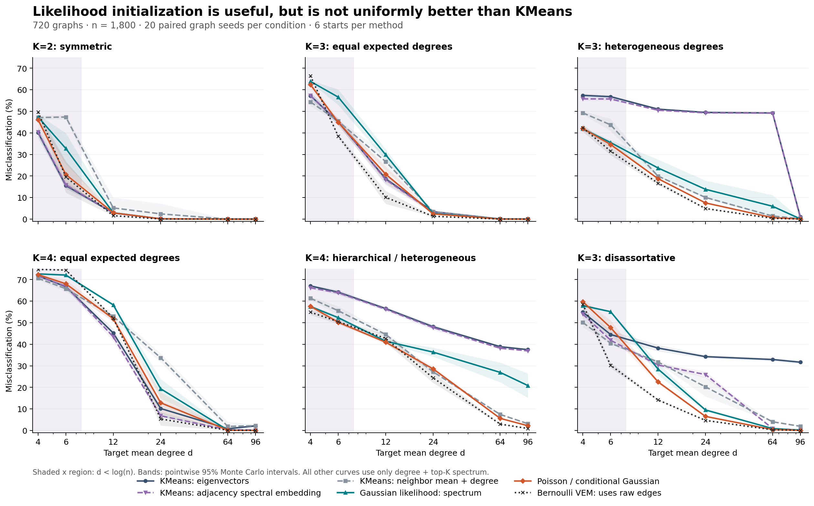

# Spectral information and likelihood-ratio inference for the SBM

本倉庫保存 **SBM 的 degree＋低秩譜資訊、likelihood 初始化，以及與 oracle LRT 的關係**這條研究線的目前成果。

**目前確認的是有限樣本實驗與若干代數關係；尚未完成只用 degree＋top-K 譜資訊即可達到 LRT 最優錯誤指數或參數資訊無損的完整證明。**

## 從這裡開始

| 內容 | 入口 |
| --- | --- |
| 當前研究狀態、已確認結論與待解問題 | [CURRENT_STATUS_20261009.md](docs/CURRENT_STATUS_20261009.md) |
| 720 張圖的完整實驗說明與重現方法 | [實驗目錄](experiments/20261009_likelihood_initialization/) · [README](experiments/20261009_likelihood_initialization/README.txt) |
| 可離線閱讀的繁體中文完整報告 | [HTML 報告](experiments/20261009_likelihood_initialization/deliverables/sbm_likelihood_initialization_report.html)（下載後開啟） |
| 全部條件、配對比較與逐圖彙整 | [結果表與圖](experiments/20261009_likelihood_initialization/deliverables/) |
| 完整逐圖輸出與 SHA256 校驗 | [正式實驗紀錄](experiments/20261009_likelihood_initialization/final/archives/) · [pilot 紀錄](experiments/20261009_likelihood_initialization/pilot_v2/archives/) |
| 先前理論草稿（歷史版本） | [TeX 與編譯／版本說明](paper/previous_draft/) |

## 目前的實驗結論

正式實驗固定 **n=1800、6 種 SBM、6 個目標平均 degrees（4、6、12、24、64、96）、每條件 20 張圖**，共 **720 張圖**。比較 13 種初始化方法，每法 6 次重啟；參數與方法在正式 graph seeds 100–119 前固定。真實標籤及真實 block probabilities 不用於擬合或選擇重啟。

主方法只使用 degree `D` 與 `W A W` 的 top-`|lambda|` K 組 eigenpairs；另有明確標示、可讀原始 `A` 的 Bernoulli VEM 作為額外資訊比較。

| 代表條件 | 比較基線 | likelihood 型初始化 | 結果 |
| --- | --- | --- | --- |
| K=3，degree 異質，d=24 | 鄰居特徵＋degree KMeans：10.050% | Poisson／conditional Gaussian：7.519% | 20/20 張圖改善；配對差 −2.531 百分點 |
| K=3，等 degree 型，d=24 | 相同特徵 KMeans：3.475% | Full GMM：2.411% | 相同起始中心；20/20 張圖改善 |
| K=4，等 degree，d=24 | ASE／RRE KMeans：6.811%／6.803% | Poisson／conditional Gaussian：12.842% | 合適的 KMeans 基線較好 |
| K=2，對稱，d=6 | U-KMeans：15.553% | Poisson／conditional Gaussian：20.669% | 稀疏對稱例子沒有均勻優勢 |

誤分率均為 20 張圖的平均，經標籤置換對齊。K=3「等 degree 型」指 block matrix 列和相同；排除自環帶來 O(d/n) 的有限樣本差異。完整結果、配對區間與負面條件均保留，不只列上表。

### 初始化與 LRT 解碼的結論必須分開

在 K=3 degree 異質、d=64 的條件，PG 初始化誤分率 **0.6778%**，但直接反解譜中心矩陣、還原 block counts、再套 plug-in LLR 後變成 **58.1639%**。19/20 張圖的 top-K 包含負向噪音方向，反解放大弱方向誤差。

這個失敗要求處理信號子空間分離與反解穩定性。**它不等於已證明 degree＋譜資訊必然不足；初始化改善也不等於已驗證 LRT 效果。** 詳見 [研究狀態](docs/CURRENT_STATUS_20261009.md) 與 [實驗限制](experiments/20261009_likelihood_initialization/EXPERIMENT_LIMITATIONS.txt)。

Gaussian mixture 與 Poisson／conditional Gaussian 優化的是工作似然；原始 A 的 VEM 優化 Bernoulli SBM 的 mean-field ELBO；signed 低秩重建上的 Bernoulli-shaped 目標只是 surrogate。倉庫不將它們混称為精確 SBM MLE。

## 重現

```bash
git clone https://github.com/zhixin0825/spectral-lrt.git
cd spectral-lrt/experiments/20261009_likelihood_initialization
python -m pip install -r requirements.txt

# 校驗並還原已歸檔的 720 張正式圖與 27 張 pilot 圖的逐圖輸出。
python restore_records.py

# 從已保存結果重建表格、圖與報告，不重新擬合。
python analyze_results.py --input final --out deliverables
python build_report.py
```

完整獨立重跑命令、套件版本、種子、各方法輸入及原始資料欄位見 [實驗 README](experiments/20261009_likelihood_initialization/README.txt)。原始 adjacency matrix 未另存；可由已保存的模型與種子重建。每張圖實際用到的 `D、U、Lambda` 與各法預測已原樣保存。

壓縮歸檔只是檔案封裝，不刪除逐圖資料。`restore_records.py` 會依 manifest 檢查檔案，還原為原程式使用的 `final/jobs/` 和 `pilot_v2/jobs/`。

## 後續接續方式

1. 先讀當前研究狀態；歷史草稿中的較強敘述不得直接當作新近核對過的定理。
2. 新方法使用獨立輸出目錄，保留本輪凍結基準與原始記錄。
3. 報告時區分「使用原始 A」與「只使用 D、U、Lambda」，並同時比較合理的 U／ASE／RRE 與 degree-aware KMeans 基線。
4. 對 LRT 或 sublogarithmic regime 的主張，需要另外完成誤差指數與解碼穩定性的理論論證。


